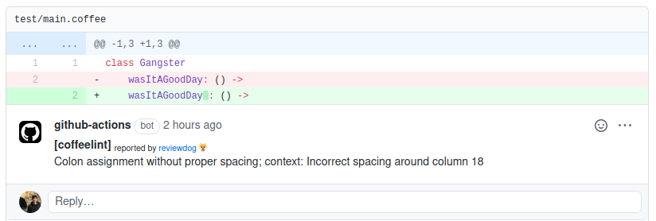

# GitHub Action: Run coffeelint with reviewdog 🐶


[](./LICENSE)
[](https://github.com/reviewdog/action-coffeelint/actions?query=workflow%3Arelease)
[](https://github.com/reviewdog/action-coffeelint/releases)

This action runs [coffeelint](https://coffeelint.github.io/) with [reviewdog](https://github.com/reviewdog/reviewdog) on pull requests to improve code review experience.



## Inputs

**github_token**

**Required**. Default is `${{ github.token }}`.

**level**

Optional. Report level for reviewdog [info,warning,error].
It's same as `-level` flag of reviewdog.

**reporter**

Reporter of reviewdog command [github-pr-check,github-check,github-pr-review].
Default is github-pr-check.
It's same as `-reporter` flag of reviewdog.

github-pr-review can use Markdown and add a link to rule page in reviewdog reports.

**filter_mode**

Optional. Filtering mode for the reviewdog command [added,diff_context,file,nofilter].
Default is added.

**fail_on_error**

Optional.  Exit code for reviewdog when errors are found [true,false]
Default is `false`.

**reviewdog_flags**

Optional. Additional reviewdog flags

**coffeelint_flags**

Optional. Flags and args of coffeelint command. Default: '.'

**workdir**

Optional. The directory from which to look for and run coffeelint. Default '.'

## Example usage

You also need to install [coffeelint](https://coffeelint.org).

```sh
# Example
$ npm install coffeelint -D
```

You can create [coffeelint config]() and this action uses that config too.

[.github/workflows/reviewdog.yml](.github/workflows/reviewdog.yml)

```yml
name: reviewdog
on: [pull_request]

jobs:
  coffeelint:
    name: runner / coffeelint
    runs-on: ubuntu-latest
    steps:
      - uses: actions/checkout@v1
      - name: coffeelint
        uses: reviewdog/action-coffeelint@v1
        with:
          reporter: github-pr-review # Change reporter.
          coffeelint_flags: 'src/'
```
